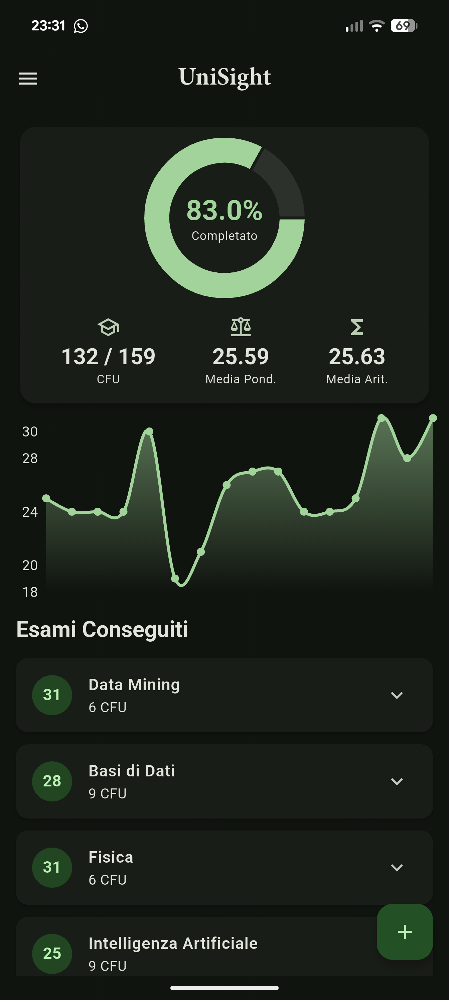
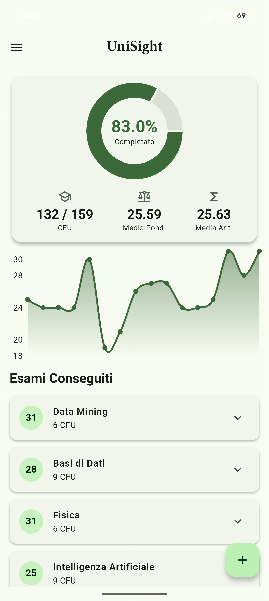
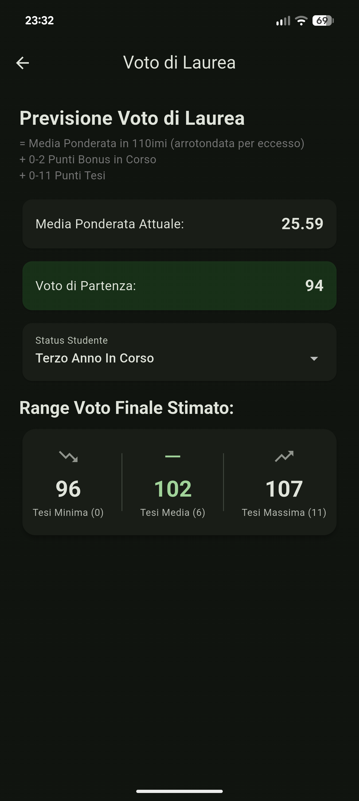
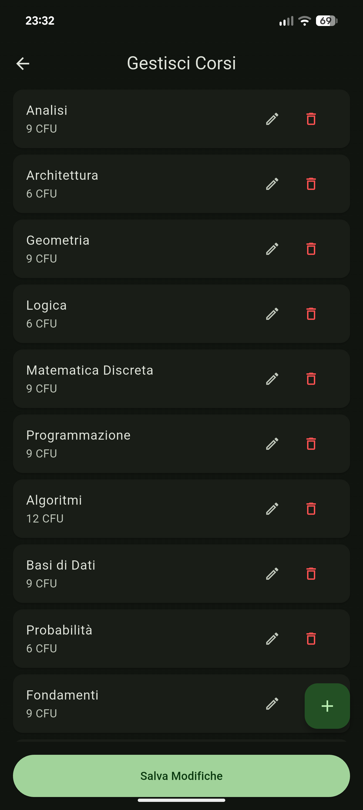

# UniSight 🎓

UniSight is a simple, no-frills mobile app to help you keep track of your university exams and grades. It's a small project designed to do one thing well: make it easier to monitor your academic progress without complicated features.

The app is **in Italian** and is primarily tailored for students at the **University of Rome Tor Vergata**, as its graduation forecast formula is based on their specific rules. However, its core tracking features can be useful for any student.

  
      
  

## ✨ Core Features

*   **Personalized Course List**: Build your own curriculum by adding your courses and their credits (CFU).
*   **Simple Grade Tracking**: Quickly add and manage your exam grades and dates.
*   **At-a-Glance Dashboard**: A clean home screen shows your progress, including completed CFU, weighted average, and arithmetic average.
*   **Graduation Forecast**: Get a practical estimate of your final grade, including:
    *   Conversion from your 30-point average to the 110-point scale.
    *   Bonus points for being "in corso" or "fuori corso".
    *   A range of outcomes based on your thesis score.
*   **Clean & Simple UI**: A focused and easy-to-navigate interface with light and dark modes.

| Graduation Forecast                                     | Course Management                                       |
| ------------------------------------------------------- | ----------------------------------------------------- |
|  |  |

## To-Do
*   **Dividere gli esami in 1o, 2o, 3o anno**
*   **Correggere formato date conseguimento esami**
*   **Crediti di tipo D e Inglese**

## 🚀 Getting Started

You can install the app by downloading the latest release APK.

1.  Go to the [**Releases**](https://github.com/haxroor/unisightapp/releases) page of this repository.
2.  Download the `UniSight.apk` file from the latest release.
3.  Transfer the file to your Android device and tap on it to install.
    *   *Note: You may need to enable "Install from unknown sources" in your device's security settings.*

## 🛠️ Built With

*   **[Flutter](https://flutter.dev/)** - For building the app from a single codebase.
*   **[Provider](https://pub.dev/packages/provider)** - For simple state management.
*   **[fl_chart](https://pub.dev/packages/fl_chart)** - For the progress charts.

## ✍️ Author

*   **Gabriele Maraia** - [haxroor](https://github.com/haxroor)

This was a personal project to create a useful tool for students. If you have any feedback or find a bug, please feel free to open an issue!
