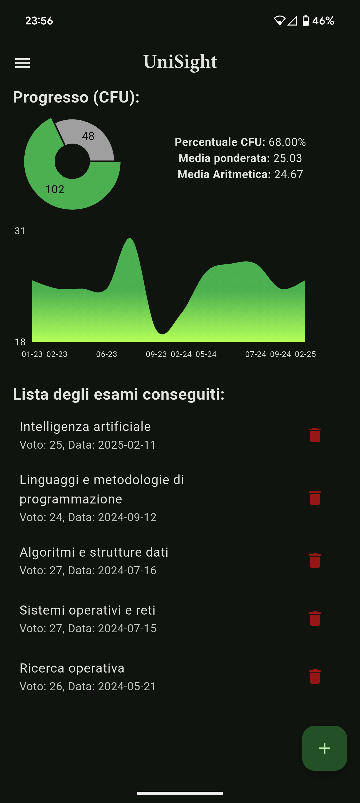
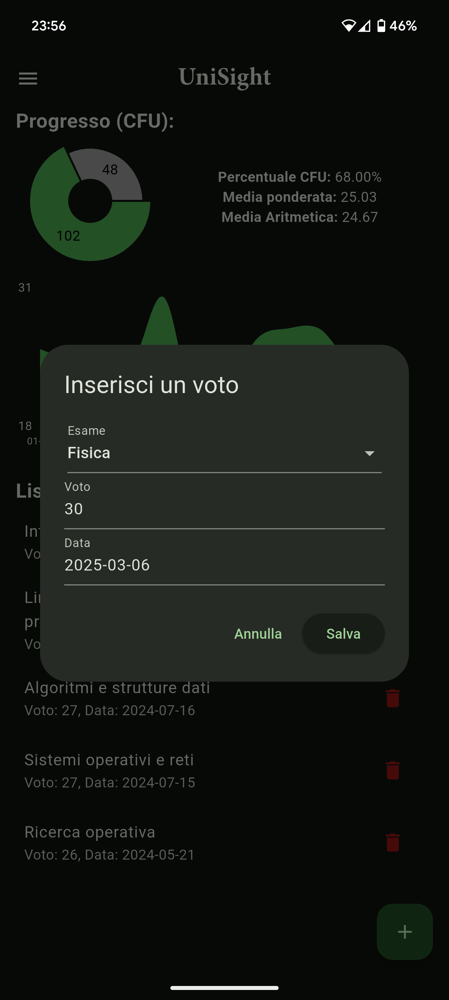
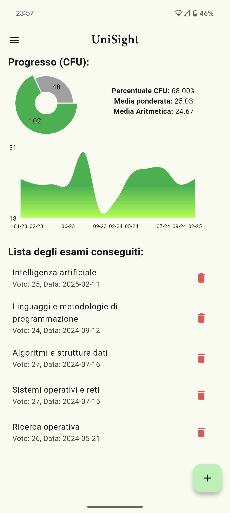

# Unisight

Unisight is a small Flutter project primarily aimed at learning the framework. The app, available in Italian, helps students keep track of their university grades, calculate both arithmetic and weighted averages, and visualize their academic progress through a graph.
It is a simple, personal project designed to help students stay organized and monitor their academic performance effectively.

## Features:
- Track university grades and calculate arithmetic and weighted averages
- Visualize grade trends with a graph
- View the percentage of completion of your degree program
### Misc Features:
- Switch between light and dark themes

## Screenshots:
  

## Installation:
You can download the latest version of the app from the [Releases page](https://github.com/haxroor/Unisight/releases). Simply download the APK and install it.
